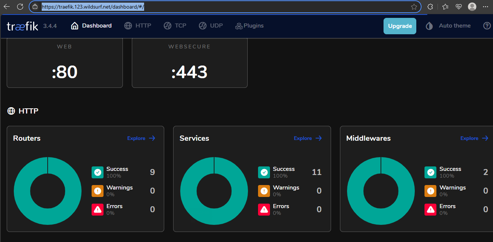

# Project: Full-Stack Application Deployment

This repository showcases a full-stack application deployed as part of a DevOps end-to-end project. 


## Table of Contents
- [Project: Full-Stack Application Deployment](#project-full-stack-application-deployment)
  - [Table of Contents](#table-of-contents)
  - [Project Overview](#project-overview)
    - [Key Objectives](#key-objectives)
  - [Project Structure](#project-structure)
  - [Docker Compose Files](#docker-compose-files)
  - [Docker Configurations](#docker-configurations)
  - [Application Code](#application-code)
  - [Monitoring Configurations](#monitoring-configurations)
  - [Proof of Work](#proof-of-work)
    - [Application Frontend:](#application-frontend)
    - [Fast API Docs:](#fast-api-docs)
    - [Adminer Web UI:](#adminer-web-ui)
    - [Traefik Dashboard:](#traefik-dashboard)
    - [Cadvisor Dashboard:](#cadvisor-dashboard)
    - [Prometheus Web UI:](#prometheus-web-ui)
    - [Grafana Dashboard - cAdvisor Metrics:](#grafana-dashboard---cadvisor-metrics)
    - [Grafana Dashboard - Loki Logs:](#grafana-dashboard---loki-logs)


## Project Overview

This project showcases a full-stack web application with a FastAPI backend and a React frontend, both containerized using Docker and managed with Docker Compose. It includes a complete monitoring and logging setup using Prometheus, Grafana, Loki, Promtail, and cAdvisor. Traefik is used as a reverse proxy to route traffic and handle HTTPS. The entire setup is cloud-ready and works on any platform with Docker installed.

---

### Key Objectives

The goal was to build and deploy a full-stack app using DevOps practices:

* **Containerization** – Packaged the backend and frontend into Docker images for easy deployment and consistency.

* **Service Orchestration** – Used Docker Compose to run and manage all services, including the app itself, the database, and the monitoring tools.

* **Traffic Routing** – Set up Traefik as a reverse proxy to manage incoming requests, route them to the right services, and handle HTTPS and domain redirection.

* **Monitoring & Logging** – Implemented tools to track performance (Prometheus, Grafana) and view logs (Loki, Promtail), with cAdvisor monitoring the containers.

* **Cloud-Ready Setup** – Both the application and monitoring stack can be easily deployed to the cloud.

---

## Project Structure

```
.
├── LICENSE
├── README.md
├── backend
│   ├── Dockerfile
│   ├── app/
│   ├── prestart.sh
│   ├── pyproject.toml
│   └── requirements.txt
├── docker-compose
│   ├── docker-compose.monitoring.yml
│   └── docker-compose.yml
├── frontend
│   ├── Dockerfile
│   ├── index.html
│   ├── package.json
│   └── src/
└── monitoring
    ├── loki-config.yml
    ├── prometheus.yml
    └── promtail-config.yml
```

## Docker Compose Files

Docker Compose is used to manage the setup, with two separate files for the app and monitoring stacks, both connected through a shared Docker network.

  * **Application Stack:** [`docker-compose/docker-compose.yml`](../docker-compose/docker-compose.yml)
  * **Monitoring Stack:** [`docker-compose/docker-compose.monitoring.yml`](../docker-compose/docker-compose.monitoring.yml)

## Docker Configurations

Each service is containerized using Dockerfiles:

  * **FastAPI Backend Dockerfile:** [`backend/Dockerfile`](../backend/Dockerfile)
  * **React Frontend Dockerfile:** [`frontend/Dockerfile`](../frontend/Dockerfile)

## Application Code

The main application logic is located within these directories:

  * **FastAPI Backend:** [`backend/`](../backend/) (Python-based API)
  * **React Frontend:** [`frontend/`](../frontend/) (ReactJS user interface)

## Monitoring Configurations

The monitoring and logging tools are configured using specific YAML files:

  * **Loki Configuration:** [`monitoring/loki-config.yml`](../monitoring/loki-config.yml)
  * **Prometheus Configuration:** [`monitoring/prometheus.yml`](../monitoring/prometheus.yml)
  * **Promtail Configuration:** [`monitoring/promtail-config.yml`](../monitoring/promtail-config.yml)


</br>

## Proof of Work

Below are screenshots of the deployed application and monitoring dashboards. These visuals demonstrate that the services are running correctly, the routing is working as expected, and metrics and logs are being captured in real time.

### Application Frontend:


### Fast API Docs:


### Adminer Web UI:


### Traefik Dashboard:




### Cadvisor Dashboard:


### Prometheus Web UI:


### Grafana Dashboard - cAdvisor Metrics:


### Grafana Dashboard - Loki Logs:


